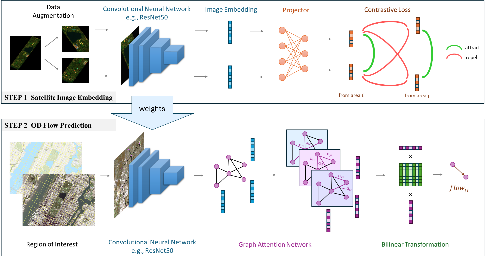

# Image2Flow
Predicting Human Mobility Flows Using Deep Learning on Satellite Imagery

**Abstract:** 
Understanding dynamically changing urban built environments and their associated human mobility flow patterns is crucial for intelligent transportation management, public health, and sustainable city development. However, the origin-destination (OD) mobility flow information between different sub-regions of cities that relies on traditional surveys is costly and time-consuming to get updated. The increasingly available high-resolution satellite imagery provides great opportunities for up-to-date earth observation and urban sensing. While the satellite imagery has been widely used for monitoring land cover and land use, and mapping population across the globe, its value in estimating human mobility flows is not yet fully explored. In this work, we develop a graph-based deep learning framework for predicting fine-grained human mobility flows in urban areas using medium-resolution (10 to 30 meter) satellite imagery. Our experiments demonstrate good performance and flexible spatial-temporal generalizability on the top-10 largest Metropolitan Statistical Areas (MSAs) of the United States. Through exploring the spatial heterogeneous effects in different metropolitan areas, we investigate the urban factors (e.g., centrality and compactness) influencing human movement distributions, enhancing our comprehension of the interactions between human mobility and physical environments. The spatial transferability of our model helps reduce regional inequality by informing decisions in data-poor regions with learning from data-rich ones. Interestingly, the typologies of urban sprawl can help explain the cross-city model generalization capability. The temporal transferability proves that the human dynamics of cities and the process of urbanization can be well captured from the observed built environment. Our research, utilizing publicly accessible satellite imagery data sources (Landsat and Sentinel), aids municipal leaders and researchers in assessing human travel demand at a large scale in a timely and low-cost manner, thus benefiting practical urban applications such as transportation infrastructure development, urban planning, epidemic modeling, and disaster response, as well as contributing to a broader understanding of the nexus between urbanization and human dynamics. 
## Architecture of Image2Flow


## Code
### Requirements

```
torch 1.13.1
torchvision 0.14.1
torch_geometric 2.4.0
torch-scatter 2.1.1
torch-sparse 0.6.17
torch-spline-conv 1.2.2
DeepGraphLibrary 1.1.2
Scikit-Learn 1.3.2
Numpy 1.26.1
Pandas 2.1.3
```

### Structure
In **step 1**, We clip the satellite images of the ROI into $N$ patches according to the division of the spatial areas, and learn a representation vector $r_i$ for each satellite image $v_i$ to characterize the visual attributes of terrestrial entities in a self-supervised manner. 

`train_img_encoder.py`: We train an encoder using the contrastive loss.

`get_img_embedding.py`: We extract the visual feature $r_i$ from satellite image $v_i$ based on the learned encoder.


In **step 2**, we regard the $N$ areas within the ROI as a graph structure to consider the geographical location, distance and nearby influences to predict the OD flows. 

`train_ODPrediction.py`: We train the OD prediction model using an 8:2:2 split. 

`test_ODPrediction.py`: To test the transferability, we test our model on an unseen city after training.

```bash
# train image encoder
python train_img_encoder.py --data_path images_path --total_epoch 120 --model_path encoder_ckpt_path --train_record train_record_name --bands 3 
# get image embedding
python get-img-embedding.py --train_record train_record_name --data_path images_path --pkl feature_name --ckpt encoder_ckpt_path  --bands 3;
# train OD Prediction model using visual features
python train_ODPrediction.py --log log_name --node_feats_path node_feats_path --region region;
# test the transferability of OD Prediction model
python test_ODPrediction.py --log log_name --node_feats_path node_feats_path --region region;
```

### Plot of the results

Once you have the predicted flows in at least a MSA based on 10-m and 30-m images, you can reproduce figures in the paper using the notebook `analyze.ipynb`.
